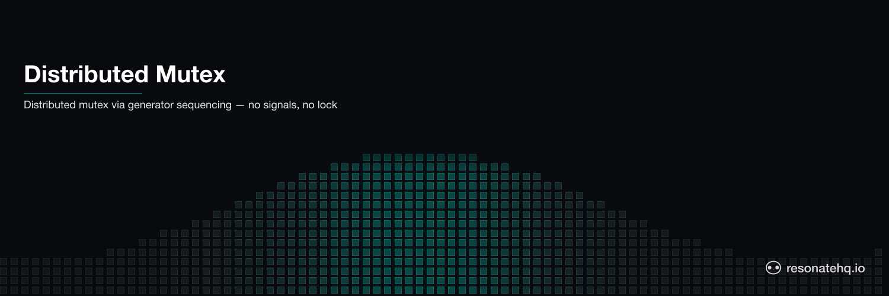

<p align="center">
  <picture>
    <source media="(prefers-color-scheme: dark)" srcset="./assets/banner-dark.png">
    <source media="(prefers-color-scheme: light)" srcset="./assets/banner-light.png">
    
  </picture>
</p>

# Distributed Mutex

Serialized access to a shared resource using Resonate's generator sequencing. Multiple workers compete for exclusive access to a payment gateway — only one at a time gets through. If a worker fails, it retries without affecting others.

## What This Demonstrates

- **Exclusive access**: only one worker touches the shared resource at a time
- **Sequential guarantees**: the generator's `yield*` calls enforce serialization
- **Crash recovery**: a failed worker retries; completed workers are not re-executed
- **No coordination infrastructure**: no signals, no lock workflows, no external lock service

## How It Works

The generator IS the mutex. Sequential `yield*` calls are serialized by the runtime:

```typescript
for (let i = 0; i < workers.length; i++) {
  const result = yield* ctx.run(accessResource, resource, workers[i], crashThis);
  results.push(result);
}
```

Each `ctx.run()` is an independent checkpoint. Worker B cannot start until Worker A completes. If Worker C crashes, it retries — but Workers A and B return from cache (not re-executed), and Workers D and E proceed normally after.

No signal handlers, no dynamic UUIDs, no `signalWithStart`, no `continueAsNew`.

## Prerequisites

- [Bun](https://bun.sh) v1.0+

No external services required. Resonate runs in embedded mode.

## Setup

```bash
git clone https://github.com/resonatehq-examples/example-distributed-mutex-ts
cd example-distributed-mutex-ts
bun install
```

## Run It

**Happy path** — 5 workers, serialized access:
```bash
bun start
```

```
=== Distributed Mutex Demo ===
Mode: HAPPY PATH  (5 workers, serialized access, no conflicts)
Resource: payment-gateway

  [worker-A] Acquired lock on "payment-gateway"...
  [worker-A] Done — 111ms, lock released
  [worker-B] Acquired lock on "payment-gateway"...
  [worker-B] Done — 112ms, lock released
  [worker-C] Acquired lock on "payment-gateway"...
  [worker-C] Done — 113ms, lock released
  [worker-D] Acquired lock on "payment-gateway"...
  [worker-D] Done — 114ms, lock released
  [worker-E] Acquired lock on "payment-gateway"...
  [worker-E] Done — 116ms, lock released

=== Result ===
{ "resource": "payment-gateway", "workersProcessed": 5, "totalMs": 595 }
```

**Crash mode** — worker-C fails, retries; A,B not re-run:
```bash
bun start:crash
```

```
  [worker-A] Acquired lock on "payment-gateway"...
  [worker-A] Done — 111ms, lock released
  [worker-B] Acquired lock on "payment-gateway"...
  [worker-B] Done — 112ms, lock released
  [worker-C] Acquired lock on "payment-gateway"...
  [worker-C] FAILED — resource timeout (lock released, retrying...)
Runtime. Function 'accessResource' failed with '...' (retrying in 2 secs)
  [worker-C] Acquired lock on "payment-gateway"...
  [worker-C] Done — 113ms, lock released (retry 2)
  [worker-D] Acquired lock on "payment-gateway"...
  [worker-D] Done — 114ms, lock released
  [worker-E] Acquired lock on "payment-gateway"...
  [worker-E] Done — 116ms, lock released

Notice: worker-A and worker-B each ran once (cached before crash).
worker-C failed → retried → succeeded. Others were not affected.
```

## What to Observe

1. **Strictly sequential**: each worker starts only after the previous one finishes
2. **No overlap**: "Acquired lock" and "Done — lock released" always alternate
3. **Crash isolation**: worker-C's failure doesn't re-run A or B, doesn't block D or E
4. **Automatic retry**: Resonate's retry handles the failure — no manual try/catch needed

## The Code

The mutex workflow is 15 lines in [`src/workflow.ts`](src/workflow.ts):

```typescript
export function* exclusiveResourceAccess(ctx, resource, workers, shouldCrash) {
  const results = [];
  for (let i = 0; i < workers.length; i++) {
    const result = yield* ctx.run(accessResource, resource, workers[i], crashThis);
    results.push(result);
  }
  return { resource, processed: results, totalMs: Date.now() - start };
}
```

The generator's sequential `yield*` calls enforce mutual exclusion. No lock primitives, no condition variables, no signal wiring.

## File Structure

```
example-distributed-mutex-ts/
├── src/
│   ├── index.ts      Entry point — Resonate setup and demo runner
│   └── workflow.ts   Mutex workflow — serialized access via generator
├── package.json
└── tsconfig.json
```

**Lines of code**: ~145 total, ~15 lines of mutex logic.

## The generator IS the lock

There is no separate lock workflow, no signal-based queue, no dedicated lock/release API. The parent generator iterates over workers and `yield*`s each one sequentially — `yield*` won't advance until the child completes. That ordering IS mutual exclusion; no additional coordination primitive is needed.

**When this pattern fits**: the common case of "process these N things, one at a time." All holders are known at workflow-start time.

**When to reach for something else**: truly dynamic distributed locking — independent workflows requesting a lock at runtime across a cluster. For that case, use Resonate's raw promise model (`ctx.promise()`) to build a lock-request queue, or reach for an external coordination service (etcd, Zookeeper, Redis Redlock).

## Learn More

- [Resonate documentation](https://docs.resonatehq.io)
